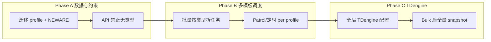

# 实施计划：TDengine 状态同步 + 多设备类型（Profile）

本文档是**待执行**的技术计划（非已实现功能说明）。当前代码库中 **尚无** TDengine 与 `device_profile` 实现；设备动作仍使用 **项目级** `ProjectDeviceSettings` 的 6 个模板 ID。

---

## 目标摘要

| 域 | 目标 |
|----|------|
| **TDengine** | 以 **SQLite/DB 在 playbook 回调后的状态** 为准写入时序库；`device_status` → 表 `status`，`healthy`→`online`，其余→`offline` |
| **写入触发** | 定时 status 模板、手动 Patrol、单设备 status — 每次执行后 **全量覆盖** 该项目（按类型分表时：该类型）全部设备 |
| **多设备类型** | 可增删类型（Profile）；每类型 6 动作各 1 模板；批量启动按类型拆多任务；每类型 1 个 status 模板 |
| **存量设备** | 迁移时 **全部归入默认 Profile `NEWARE`** |
| **无类型** | **禁止** 启动/停止/巡检等操作（API + UI） |

---

## 现状（基线）

- `project__device`：`device_status`（healthy/unhealthy/checking）、`winrm_status`、`api_status` 等。
- `ProjectDeviceSettings`：**项目级** `*_template_id`（discover/start/stop/restart/status/config），**无** device_type。
- 回调：`PUT /api/project/{id}/devices/status/bulk` → `BulkUpdateDeviceStatus` 更新 DB。
- 定时：`DeviceStatusScheduler` → TCP 探针 + 可选 enqueue **一个** status 模板（全项目）。
- Patrol：`RunPatrolForAllDevices` → **一个** status 任务、`devices` 全量 extra-vars。
- Playbook 回调：play1 登记 `semaphore_callback_row` + **localhost 第二 play** bulk PUT（已去掉 immediate PUT）。

---

## 一、TDengine

### 1.1 配置（全局 + 可扩展多表）— **支持页面填写**

**可以，而且建议以管理端页面为主**；`config.json` 仅作首次部署/无 UI 时的兜底（与 LDAP、邮件告警等类似，Semaphore 很多全局项仍在文件里，TDengine 可做成第一批「可在线改」的集成项）。

#### 配置来源优先级（运行时合并）

| 优先级 | 来源 | 用途 |
|--------|------|------|
| 1（最高） | **DB `options` 或专用表**（Admin API 保存） | 运维在页面改 URL、库名、开关、密码 |
| 2 | `config.json` → `tdengine` | 安装脚本/容器首次启动默认值 |
| 3 | 环境变量 | `SEMAPHORE_TDENGINE_*` 覆盖（可选，适合 K8s Secret） |

页面保存后 **立即生效**（进程内 `util.Config.TDengine` 重载或从 store 每次读取）；改密码不必重启整站（若实现热加载）。

#### 管理端 UI（建议）

- **入口**：Admin → **系统设置** → 选项卡 **「TDengine / 时序库」**（或挂在现有 Admin 区域，需 `user.admin`）。
- **表单字段**：
  - 启用开关 `enabled`
  - REST/SQL 地址 `url`
  - 用户 `user`
  - 密码 `password`（保存后 API **不回显**，仅「已设置」占位）
  - 数据库 `database`
  - **测试连接** 按钮（调用 `POST /api/admin/tdengine/test`）
- **按设备类型分表**（与 Profile 联动后）：
  - 在 **项目 → 设备类型（Profile）** 编辑页增加：`TDengine 状态表名`（默认 NEWARE → `status`）
  - 全局页只显示「默认表名规则」说明；**每类型表名跟 Profile 走**，不在全局页堆一张大表

#### API（Admin）

| 方法 | 路径 | 说明 |
|------|------|------|
| GET | `/api/admin/tdengine` | 返回配置（密码脱敏） |
| PUT | `/api/admin/tdengine` | 保存到 DB options / `system__tdengine_config` JSON |
| POST | `/api/admin/tdengine/test` | 探活 + 可选 `SHOW STABLES` |

实现可复用现有 **`GET/POST /api/options`**（`db.Option` key-value），例如：

- `tdengine.enabled`, `tdengine.url`, …  
或单 key `tdengine.config` 存 JSON（便于 `profiles` 子对象扩展）。

#### `config.json` 结构（兜底，与页面字段一致）

```json
{
  "tdengine": {
    "enabled": false,
    "url": "http://127.0.0.1:6041",
    "user": "root",
    "password": "",
    "database": "semaphore_devices"
  }
}
```

**按设备类型的 `status_table`** 建议放在 **Profile 设置**（`project__device_profile_settings.tdengine_status_table`），不要写死在全局 JSON，方便「多类型多表」。

设计要点：

- **连接/认证**：全局一份（页面或 config）。
- **按设备类型分表**：Profile 级 `tdengine_status_table`；NEWARE 默认 **`status`**。
- 无页面时仍可用 config/env 启动；**有页面后运维不必 SSH 改 json**。

### 1.2 数据模型（TDengine）

**超级表/子表**（按团队 TDengine 规范二选一；计划默认 **按设备一行最新状态** 的宽表或 tag=project_id+device_id）：

建议首期 **子表 per device** 或 **单表 + tags**：

| 列/标签 | 说明 |
|---------|------|
| `ts` | 写入时间（ms） |
| `project_id` | 项目 |
| `device_id` | 设备 ID |
| `hostname` / `ip` | 维度 |
| `status` | **`online` / `offline`**（来自 DB 映射，见下） |
| `device_status_raw` | 可选，保留 `healthy`/`unhealthy`/`checking` 便于排查 |
| `winrm_status` / `api_status` | 可选同步 |

**映射规则（写 TDengine 前，以 DB 为准）：**

```text
device_status == healthy  → status = online
其他任何 device_status   → status = offline
```

不直接用 playbook 的 `api_status`/`winrm_status` 作为 TDengine 的 `status` 列（避免与「DB 为准」冲突）；探针列可另字段写入。

### 1.3 写入时机与「全量覆盖」

| 触发源 | DB 更新路径 | TDengine 写入 |
|--------|-------------|----------------|
| 定时 status 模板结束 | bulk 回调 → DB | **任务成功后**：读该项目（+profile 过滤）**全部设备** 当前 DB 行，批量 INSERT/UPSERT 到对应 `status_table` |
| 手动 Patrol | 先 marking checking → playbook bulk → DB | 同上，在 **bulk API 成功之后** 或 **Ansible 任务 End hook**（见下） |
| 单设备 status | bulk 更新 1 台 | **仍写全量**：同项目该 profile 下 **所有设备** 当前 DB 快照（非只写 1 台） |

**原则（需求 4）**：TDengine **不以 playbook 行直接为准**；顺序为：

1. Playbook → `PUT .../status/bulk` → **DB 已更新**
2. `BulkUpdateDeviceStatus` 返回成功后 → 调用 `PublishProjectStatusSnapshot(projectID, profileKey?)`
3. 定时任务若仅 TCP 探针未跑 playbook：可选 **不写 TDengine** 或写探针衍生状态（需求明确以 playbook 回调后 DB 为准 → **仅 status 模板/Patrol/单设备 status 任务完成后写**）

### 1.4 代码落点（建议包结构）

| 步骤 | 路径 | 说明 |
|------|------|------|
| P0 | `pkg/tdengine/client.go` | REST/SQL 客户端、`Exec`、`InsertStatusRows` |
| P0 | `util/config.go` | `TDengineConfig` + 校验 + 从 DB options 合并加载 |
| P0 | `api/admin_tdengine.go` + `web` Admin 表单 | **页面填写**、测试连接、密码脱敏 |
| P1 | `services/server/tdengine_publish.go` | `MapDeviceStatusToTD(healthy→online)`、`PublishProjectStatusSnapshot` |
| P1 | `api/projects/devices.go` | `BulkUpdateDeviceStatus` 末尾 `go publish...`（enabled 时） |
| P2 | `services/tasks/hooks/ansible.go` | `End()`：若模板为 device status 类（见 1.5）且 bulk 已在 API 完成，可 **去重** 仅 hook 补写（或 hook 只打日志，以 API 为准） |
| P2 | `services/server/device_status_scheduler.go` | enqueue 后不在探针写 TD；**任务完成** 由 hook/API 触发 snapshot |

**1.5 识别「status 类任务」**

- 模板 ID == 该设备 profile 的 `StatusTemplateID`，或
- Task extra-vars 含 `devices` / `device` + playbook 名 `device_status.yml`（可配置映射表）。

### 1.5 验收（TDengine）

- [ ] `enabled=false` 时零副作用
- [ ] 一次 Patrol 后，TDengine `status` 表行数 = 该项目 NEWARE 设备数；`healthy` 设备为 `online`
- [ ] 单设备 status 后，**全项目** 设备在 TDengine 中刷新（非 1 行）
- [ ] DB 仍为 UI 与 API 主数据源；TDengine 与 DB 不一致时以 DB 为准

---

## 二、多设备类型（Device Profile）

### 2.1 概念

- **Profile**（类型）：如 `NEWARE`、`LINE_B`；可新增；决定 playbook 集合与模板绑定。
- **Device.device_profile_id**（或 `profile_key` 字符串）：每台设备归属一个 Profile。
- **ProjectDeviceProfileSettings**：**每个 (project_id, profile_id)** 一套 6 模板 ID + `status_refresh_interval`（可选继承项目默认）。

### 2.2 数据模型（DB 迁移 v2.18.15+）

```sql
-- project__device_profile
id, project_id, key (unique per project), name, playbook_dir?, enabled, created

-- project__device_profile_settings  
project_id, profile_id,
discover_template_id, start_template_id, stop_template_id,
restart_template_id, status_template_id, config_template_id,
default_inventory_id, default_config_json, status_refresh_interval_min,
tdengine_status_table   -- 默认 NEWARE → 'status'，可在 Profile 编辑页填写

-- project__device
+ device_profile_id NOT NULL  -- 迁移：现有行 → NEWARE profile id
```

- 种子数据：每个已有项目 `INSERT profile key='NEWARE', name='NEWARE'`。
- **迁移脚本**：`UPDATE project__device SET device_profile_id = <neware_id> WHERE device_profile_id IS NULL`。

### 2.3 模板与 Playbook

| 动作 | 常量 | 每 Profile 一个模板 |
|------|------|---------------------|
| 发现 | discover | ✓ |
| 启动 | start | ✓ |
| 停止 | stop | ✓ |
| 重启 | restart | ✓ |
| 状态/巡检 | status | ✓（Patrol 用此模板） |
| 配置/应用配置 | config | ✓（可与 restart 共用 playbook，但模板 ID 独立） |

- Playbook 路径可约定：`cursor-playbooks/profiles/<profile_key>/device_start.yml`，首期 **NEWARE 仍用现有** `cursor-playbooks/device_*.yml`（软链接或复制），新类型再加目录。
- **新增类型**：Admin UI 创建 Profile → 绑定 6 个 Semaphore 模板 → 指定 playbook 路径/仓库。

### 2.4 API / 调度行为

| 场景 | 行为 |
|------|------|
| **单设备操作** | `device_profile_id` 为空 → **400**，禁止 |
| **批量启动/停止/重启** | `GroupDevicesByProfile(devices)` → **每个 profile 一个 Task**（各自 inventory + extra-vars） |
| **Patrol** | 按 profile **拆分多个 status 任务**（或一个任务多台仅限同 profile — 推荐 **每 profile 一任务**） |
| **定时 refresh** | `GetProjectsDueForStatusRefresh` 扩展为 per-profile 间隔；对每个 profile enqueue 其 `StatusTemplateID` |
| **runDeviceTemplate** | 签名改为 `(project, profileSettings, action, extraVars)` |

### 2.5 UI

- 设备列表：列 **类型（Profile）**；筛选按 profile。
- 设备表单：必选 Profile（默认 NEWARE）。
- 项目设置：**「设备类型」** Tab — 列表 Profile + 每类型 6 模板下拉；保留「项目默认」作迁移期兼容（只读提示：请改用 NEWARE 类型设置）。
- 批量操作：前端按选中设备 profile 分组提示「将创建 N 个任务」。

### 2.6 TDengine 与 Profile 联动

- `PublishProjectStatusSnapshot(projectID, profileKey)` 只写该 profile 对应 `status_table`。
- 一次 Patrol（仅 NEWARE）只覆盖 `status`（NEWARE 表），不覆盖其他类型表。

### 2.7 验收（多设备类型）

- [ ] 存量设备均为 NEWARE，操作正常
- [ ] `device_profile_id` 为空设备：API 拒绝 start/stop/patrol
- [ ] 批量启动含 NEWARE+A 两台 → 2 个 task
- [ ] 每类型独立 status 模板；Patrol 只跑该类型设备
- [ ] 项目设置中可新增类型并绑定 6 模板

---

## 三、实施顺序（推荐）



| 阶段 | 内容 | 依赖 |
|------|------|------|
| **A1** | 迁移 + `device_profile_id` + 默认 NEWARE | — |
| **A2** | `ProjectDeviceProfileSettings` CRUD API + UI 类型页 | A1 |
| **A3** | 无类型禁止操作；`runDeviceTemplate` 读 profile settings | A1 |
| **B1** | 批量动作按 profile 拆多任务 | A3 |
| **B2** | Patrol / scheduler 按 profile _enqueue status | A3 |
| **C1** | `pkg/tdengine` + config | — |
| **C2** | `BulkUpdateDeviceStatus` 后全量写 TDengine（映射 healthy→online） | C1, A1（按表） |
| **C3** | Ansible `End` hook 兜底（可选，与 C2 去重） | C2, B2 |

**说明**：TDengine（C）可与 B 并行，但 **分表** 依赖 A1 的 profile_key。

---

## 四、与现有 playbook 的契约（不变部分）

- 回调仍用 `PUT /devices/status/bulk`；字段 `device_status` / `status`（playbook 内 `semaphore_callback_row`）。
- **第二 play localhost bulk** 继续作为批量写回主路径。
- Patrol 仍可先置 `checking`，playbook 写回 healthy/unhealthy。

TDengine **不替代** bulk API；仅只读副本/报表/大屏。

---

## 五、风险与决策记录

| 项 | 决策 |
|----|------|
| 全量覆盖 vs 增量 | 按需求 **每次全量** 写当前 DB 快照；TDengine 侧用 INSERT 新时间戳或 REPLACE 策略由 DBA 定 |
| 定时探针是否写 TD | **否**（仅以 playbook 回调后 DB 为准）；探针只更新 DB 列，不写 TD |
| `ProjectDeviceSettings` 旧字段 | 迁移期双读：优先 profile settings，无则 fallback 项目级（ deprecate ） |
| 第二 play 与 TDengine | TDengine 在 **Go API bulk 成功之后**，不解析 Ansible 日志 |

---

## 六、任务拆解（Issue 清单）

1. **db**: migration `device_profile` + `device_profile_id` + seed NEWARE  
2. **db/store**: `GetProfileSettings`, `ListProjectProfiles`, device CRUD 校验 profile  
3. **api**: `BulkUpdateDeviceStatus` → `PublishProjectStatusSnapshot`  
4. **api**: `RunPatrolForAllDevices` / `RunBulkDeviceAction` 按 profile 分组 enqueue  
5. **scheduler**: per-profile status template + interval  
6. **pkg/tdengine**: client + config  
7. **web**: **Admin TDengine 设置页** + Profile 管理 UI + 设备必选类型 + 批量任务提示  
8. **docs**: 运维文档 TDengine 建表 SQL 示例（`status` 超级表）  
9. **playbooks**（后期）: `profiles/<key>/` 目录规范  

---

## 七、配置示例（运维）

```sql
-- TDengine 示例（NEWARE 使用表 status）
CREATE DATABASE IF NOT EXISTS semaphore_devices;
CREATE STABLE IF NOT EXISTS semaphore_devices.status (
  ts TIMESTAMP,
  status NCHAR(16),
  device_status_raw NCHAR(16),
  winrm_status NCHAR(16),
  api_status NCHAR(16)
) TAGS (project_id INT, device_id INT, hostname NCHAR(128), ip NCHAR(64));
```

---

*文档版本：与 `develop` 分支 playbook 回调模型（post_tasks + localhost 第二 play）对齐。*
