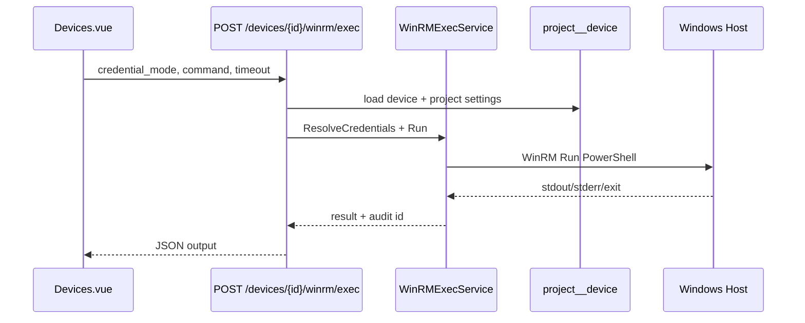

# Plan: WinRM 命令窗口（设备远程命令）

> 在设备管理页增加 **WinRM 命令窗口**：可选择 **RDP 凭据对** 或 **WinRM 凭据对** 连接目标 Windows 主机，输入命令执行并查看输出；内置常用示例（查进程、端口、目录等）。
>
> **范围说明：** 首版为 **单次命令执行 + 输出回显**（非完整交互式 PTY Shell）。后续可演进为 WebSocket 流式会话。

---

## 1. 背景与目标

### 1.1 现状

| 能力 | 已有 | 缺口 |
|------|------|------|
| 设备 WinRM 字段 | `ansible_user/password`、transport、scheme、port、cert | 无「临时选凭据执行单条命令」入口 |
| 设备 RDP 字段 | `rdp_user/password`、`rdp_port` | 仅用于 playbook extra-vars / 探测，**不能用于 WinRM**（协议不同） |
| 项目 WinRM 默认 | `GET/PUT /devices/settings/connection` | 设备未填时 inventory 会合并，但 UI 无统一「解析后凭据预览」 |
| 远程执行 | Ansible 模板任务（`win_shell`） | 异步、秒级延迟、需绑模板，不适合 ad-hoc 排障 |
| 探测 | `POST /devices/{id}/probe` | **仅 TCP 端口**，不验证账号密码 |
| 终端 UI | 无 | TaskLog 只读，非设备 Shell |

### 1.2 目标（MVP）

1. 设备列表/详情提供 **「WinRM 命令」** 入口，打开对话框。
2. **凭据来源** 二选一（单选）：
   - **WinRM 凭据对**：设备 `ansible_*` + 项目默认 WinRM 连接参数（与生成 inventory 一致）。
   - **RDP 凭据对**：设备 `rdp_user` / `rdp_password`（**仍通过 WinRM 协议执行**；仅账号密码来源不同，便于「用桌面登录账号试命令」）。
3. 文本框输入 **单条 PowerShell 命令**（或 `cmd.exe /c` 包装），点击执行。
4. 展示 **stdout / stderr / 退出码 / 耗时**；失败时明确区分：凭据、网络、WinRM 协议、命令本身错误。
5. **示例命令** 一键填入（可分组：进程 / 网络 / 文件系统 / 服务）。
6. **安全**：权限控制、审计日志、输出长度限制、密码不落前端持久化日志。

### 1.3 非目标（首版不做）

- 浏览器内 RDP 客户端、Guacamole、完整 xterm 交互式 Shell。
- 通过 RDP 协议执行命令（仅 WinRM 传输；RDP 只是凭据来源选项）。
- 批量对多台设备同时执行（可二期：勾选设备 + 同一命令）。
- 在 Semaphore 任务系统里为每条命令创建 Ansible Task（首版走直连 WinRM，见 §4）。

---

## 2. 用户体验

### 2.1 入口

`Devices.vue` 行操作区增加按钮（建议图标 `mdi-console`）：

- 标题：`WinRM 命令` / `WinRM console`
- 禁用条件（灰显 + tooltip）：
  - `winrm_status === 'offline'` 且用户未勾选「仍要尝试」
  - 设备无 IP
  - 所选凭据对解析后 user 为空

可选：设备编辑页 `DeviceForm.vue` 底部「测试 WinRM 命令」链接，打开同一对话框。

### 2.2 对话框布局（`DeviceWinrmConsoleDialog.vue`）

```
┌─────────────────────────────────────────────────────────┐
│ WinRM 命令 — {hostname} ({ip})                    [×]   │
├─────────────────────────────────────────────────────────┤
│ 连接摘要: winrm://{user}@{host}:{port}  transport=...   │
│ WinRM 状态: [online/offline]  [探测]                    │
├─────────────────────────────────────────────────────────┤
│ 凭据:  (●) WinRM 凭据对   ( ) RDP 凭据对                │
│        用户: DOMAIN\user  （设备字段 / 项目默认）        │
│        [ ] 显示将使用的解析结果（不显示密码）            │
├─────────────────────────────────────────────────────────┤
│ 示例: [进程] [端口] [目录] [服务] [磁盘] [事件日志]      │
├─────────────────────────────────────────────────────────┤
│ 命令 (PowerShell):                                       │
│ ┌─────────────────────────────────────────────────────┐ │
│ │ Get-Process | Sort-Object WS -Descending | ...    │ │
│ └─────────────────────────────────────────────────────┘ │
│ [执行]  [清空]                                           │
├─────────────────────────────────────────────────────────┤
│ 输出:                                                    │
│ ┌─────────────────────────────────────────────────────┐ │
│ │ stdout...                                           │ │
│ │ stderr...                                           │ │
│ └─────────────────────────────────────────────────────┘ │
│ exit_code=0  duration=1.2s                               │
└─────────────────────────────────────────────────────────┘
```

### 2.3 凭据解析规则（与 inventory 对齐）

复用后端 `BuildDeviceInventoryLine` / 现有 merge 逻辑，保证与 Ansible 任务一致：

| 字段 | WinRM 凭据对 | RDP 凭据对 |
|------|----------------|------------|
| user | `device.ansible_user` → `settings.default_ansible_user` | `device.rdp_user`（无项目级 RDP 默认则必须设备上配置） |
| password | `device.ansible_password` → `settings.default_ansible_password` | `device.rdp_password` |
| host | `device.ip_address` | 同左 |
| port | `EffectiveDeviceAnsiblePort(device, settings)` | **仍用 WinRM 端口**（5985/5986），不用 RDP 3389 |
| transport / scheme / cert | 设备字段 → 项目默认 | **仍用 WinRM 连接参数** |

UI 文案需写清：**「RDP 凭据对」= 使用 RDP 用户名密码，通过 WinRM 执行命令。**

### 2.4 内置示例命令（PowerShell）

**进程**

```powershell
Get-Process | Sort-Object WorkingSet64 -Descending | Select-Object -First 15 Name, Id, @{N='WS_MB';E={[math]::Round($_.WorkingSet64/1MB,1)}}
```

```powershell
Get-Process -Name 'sinexcel_agent' -ErrorAction SilentlyContinue | Format-List *
```

**端口**

```powershell
Get-NetTCPConnection -State Listen | Sort-Object LocalPort | Select-Object LocalAddress, LocalPort, OwningProcess, @{N='Process';E={(Get-Process -Id $_.OwningProcess -ErrorAction SilentlyContinue).Name}}
```

```powershell
netstat -ano | findstr LISTENING
```

**目录 / 文件**

```powershell
Get-ChildItem 'C:\Program Files' -Directory | Select-Object Name, LastWriteTime
```

```powershell
Test-Path 'D:\Program Files\NEWARE'; if ($?) { Get-ChildItem 'D:\Program Files\NEWARE' -Recurse -Depth 2 | Select-Object FullName, Length, LastWriteTime }
```

**服务**

```powershell
Get-Service | Where-Object { $_.Status -eq 'Running' } | Select-Object Name, DisplayName, Status
```

**磁盘**

```powershell
Get-PSDrive -PSProvider FileSystem | Select-Object Name, @{N='Used_GB';E={[math]::Round($_.Used/1GB,2)}}, @{N='Free_GB';E={[math]::Round($_.Free/1GB,2)}}
```

**环境 / 会话（排障 WinRM 交互用户）**

```powershell
query user
```

```powershell
$env:USERNAME; [System.Security.Principal.WindowsIdentity]::GetCurrent().Name
```

示例在 UI 中以 **chip / 下拉** 展示；点击仅填充命令框，不自动执行。

---

## 3. 技术方案

### 3.1 推荐：Go 直连 WinRM（首版）

Semaphore 后端新增 **同步** API，使用 Go WinRM 客户端（如 `github.com/masterzen/winrm`）：

- 优点：秒级以内响应、无需为每条命令建 Task、不污染任务历史。
- 缺点：需在 Semaphore 服务端能访问设备 WinRM 端口；需处理 HTTPS/自签证书（`ansible_winrm_server_cert_validation=ignore` 时跳过校验）。

**备选（二期或降级）：** Ansible ad-hoc `win_shell` + 临时 inventory，延迟高，仅当直连库不可用时 fallback。

### 3.2 架构图



### 3.3 API 设计

**执行命令**

```
POST /api/project/{project_id}/devices/{device_id}/winrm/exec
```

Request:

```json
{
  "credential_mode": "winrm",
  "command": "Get-Process | Select-Object -First 5 Name,Id",
  "shell": "powershell",
  "timeout_seconds": 60
}
```

- `credential_mode`: `"winrm"` | `"rdp"`
- `shell`: `"powershell"`（默认）| `"cmd"`（内部包装为 `cmd.exe /c`）

Response `200`:

```json
{
  "ok": true,
  "exit_code": 0,
  "stdout": "...",
  "stderr": "",
  "duration_ms": 842,
  "resolved_user": "Administrator",
  "resolved_host": "10.33.34.39",
  "resolved_port": 5985
}
```

Response `4xx/5xx`（结构化错误）:

```json
{
  "ok": false,
  "error": "winrm_auth_failed",
  "message": "Access is denied",
  "stdout": "",
  "stderr": "..."
}
```

错误码建议：`missing_credentials`, `winrm_unreachable`, `winrm_auth_failed`, `command_timeout`, `command_too_long`, `output_truncated`.

**解析凭据预览（可选，打开对话框时）**

```
GET /api/project/{project_id}/devices/{device_id}/winrm/connection-preview?credential_mode=winrm
```

返回 host/port/user/transport/scheme（**不含密码**），供 UI 展示。

### 3.4 后端模块

| 模块 | 路径 | 职责 |
|------|------|------|
| 凭据解析 | `services/server/device_winrm_credentials.go` | `ResolveDeviceWinRMExecCredentials(device, settings, mode)` |
| 执行器 | `services/server/device_winrm_exec.go` | 连接池/单次 Run、超时、输出截断 |
| HTTP | `api/projects/devices.go` | `ExecDeviceWinRMCommand`, `PreviewDeviceWinRMConnection` |
| 审计 | `db` 新表或 `project__device_exec_log` | user_id, device_id, command_hash, exit_code, 时间（**不存密码**；stdout 可选摘要或截断存储） |
| 路由 | `api/router.go` | 注册上述路由 |

**限制**

| 项 | 建议值 |
|----|--------|
| 命令最大长度 | 8 KB |
| 超时 | 5–120 s，默认 60 |
| stdout/stderr 最大返回 | 256 KB（超出标记 `output_truncated`） |
| 并发 | 每设备同时 1 条；每用户每分钟 N 次（防滥用） |

### 3.5 前端模块

| 文件 | 职责 |
|------|------|
| `web/src/components/DeviceWinrmConsoleDialog.vue` | 对话框主体 |
| `web/src/views/project/Devices.vue` | 入口按钮、打开对话框 |
| `web/src/lang/zh_cn.js`, `en.js` | i18n |
| 可选 `web/src/lib/deviceWinrmExamples.js` | 示例命令常量 |

交互：执行中按钮 loading；输出区 monospace + 自动滚动到底；复制输出按钮。

### 3.6 权限

- 复用项目成员身份 + 设备管理写权限（与 `PUT /devices/{id}` 同级或更严）。
- 建议新增细粒度：**`DeviceWinRMExec`**（仅 Owner/Admin 或配置开关），避免所有项目成员对生产机执行任意命令。
- 审计记录：`user_id`, `username`, `device_id`, `ip`, `credential_mode`, `command`（或 SHA256）, `exit_code`, `created`。

---

## 4. 安全与合规

1. **密码**：API 请求体不传密码（一律服务端从 DB 解析）；响应永不返回密码。
2. **日志**：Semaphore 应用日志、审计表 **禁止** 打印完整 password；stdout 中若检测到疑似密钥可告警（二期）。
3. **命令注入**：WinRM 客户端使用参数化执行，不把用户输入拼进本地 shell。
4. **网络**：仅允许对 **本项目已登记设备 IP** 发起连接（防 SSRF）。
5. **HTTPS WinRM**：尊重 `ansible_winrm_scheme=https` 与 cert validation 设置。
6. **列表 API**：长期可考虑列表接口脱敏 `ansible_password` / `rdp_password`（与命令窗口独立，但建议同一迭代评估）。

---

## 5. 实施阶段

### Phase 1 — MVP（建议 1 个 PR）

- [ ] `ResolveDeviceWinRMExecCredentials` + WinRM exec 服务（PowerShell only）
- [ ] `POST .../winrm/exec` + 路由
- [ ] `DeviceWinrmConsoleDialog.vue` + Devices 入口
- [ ] 示例命令 chips（进程/端口/目录）
- [ ] i18n zh/en
- [ ] 单元测试：凭据解析、错误码；集成测试可选（mock WinRM）

### Phase 2 — 体验与安全

- [ ] `GET .../winrm/connection-preview`
- [ ] 审计表 + 项目设置页「允许 WinRM 命令」开关
- [ ] 输出复制、命令历史（仅当前会话 localStorage，不上传）
- [ ] 更多示例（服务、磁盘、query user）

### Phase 3 — 可选演进

- [ ] WebSocket 流式输出 / 多行交互 Shell
- [ ] 批量设备执行（只读类命令白名单）
- [ ] Ansible fallback 模式（环境无直连 WinRM 库时）

---

## 6. 测试要点

| 场景 | 期望 |
|------|------|
| WinRM 凭据对 + 项目默认补全 | 与 Ansible 任务同一账号能执行 |
| RDP 凭据对 + 空 rdp_user | 明确错误 `missing_credentials` |
| 错误密码 | `winrm_auth_failed`，不泄露 stack 到 UI |
| 离线设备 | 默认阻止；勾选「仍要尝试」可发请求 |
| 长输出 | 截断 + `output_truncated=true` |
| 超时 | `command_timeout`，连接断开 |
| 权限 | 无权限用户 403 |

---

## 7. 依赖

- Go：`github.com/masterzen/winrm`（或维护中的 fork），评估与 Go 1.24 兼容性。
- 部署：Semaphore 进程需能访问设备网段 WinRM 端口（与 Ansible runner 网络要求相同）。

---

## 8. 开放问题（需产品确认）

1. **RDP 凭据对** 是否在 RDP 用户为空时 **禁止** 选择（推荐：是）？
2. 审计是否 **必须落库**，还是首版仅应用日志？
3. 是否允许执行 **写操作** 命令（停进程、删文件），还是 MVP 仅提示「谨慎操作」？
4. 命令窗口是否 **仅 Windows 设备类型** 显示（按 `device_profile` 过滤）？
5. 是否与现有 **Probe** 联动：执行前自动 `probe` 刷新 `winrm_status`？

---

## 9. 相关代码索引

| 主题 | 路径 |
|------|------|
| 设备模型 | `db/Device.go` |
| Inventory 凭据合并 | `services/server/device_inventory.go` |
| 设备 API | `api/projects/devices.go`, `api/router.go` |
| 设备列表 UI | `web/src/views/project/Devices.vue` |
| 凭据表单 | `web/src/components/DeviceForm.vue` |
| 项目 WinRM 默认 | `web/src/components/DeviceProjectConnectionSettings.vue` |
| Playbook win_shell 参考 | `cursor-playbooks/**/tasks/*.yml` |

---

*文档版本：初稿。确认 §8 开放问题后可拆 Phase 1 任务进实现 PR。*
